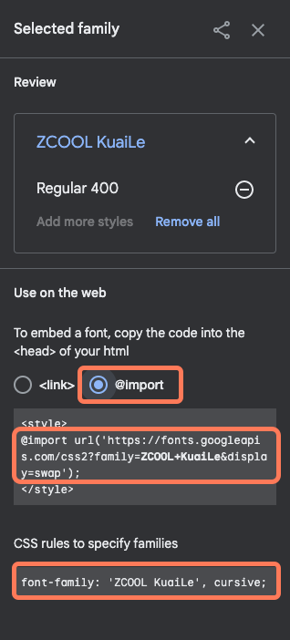
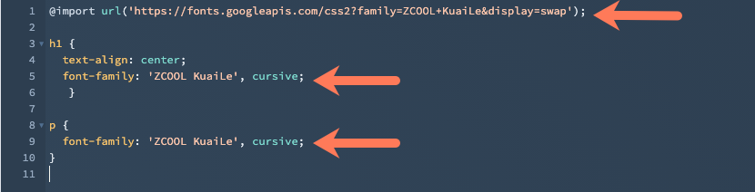

# ESTILOS CSS

CSS é uma linguagem de estilização, interpretada pelos navegadores de internet afim de criar um sistema de naveção visualvemente mais agradavel, manipulando assim todos os componentes visiveis em tela, cor, fonte espaço e etc.

## PROPRIEDADES DE CORES

As cores em CSS podem ser representadas e varias maneiras diferentes, as principais são:

- RGB
    - representa as cores RED, (vermelho) representado de 0 a 255
    - representa as cores GREEN, (verde) representado de 0 a 255
    - representa as cores BLUE, (azul) representado de 0 a 255
- Hexadecimal
    - representado pela # e uma sequencia de 6 digitos que variam de 0 a F, sendo cada par de digitos referente a uma cor.
- HSL
    - representa em porcentagem a quantidade de matiz, saturação e brilho.

exemplos:

```css
\* representação por nome *\
.h1 {
    color: CornflowerBlue;
} 

\* representação por hexadecimal *\

.h2 {
    color: #6495ED;
}

\* representação por RGB *\
.h3 {
    color: rgb(100,149,237);
}

\* representação por HSL *\
.h4 {
    color: hsl(0, 100%, 25%);
}
```


## TIPOGRAFIA (FONTES)

Fontes são elementos visuais muito importantes em plataformas digitais, é importante saber escolher a tipografia correta para o site, pois a fonte escolhida conversa muito com o usuario final e contribui para a harmonia visual.

### font-family

Podemos usar a fonte padrão do browser, sendo elas:

- serifadas
- não serifadas
- sursivas
- monoespaçadas (normalmente usada para apresentar codigos)
- fantasia

Ou também podemos usar fotes nomeadas, e separando por virgula colocar outras opções caso o navegar não consiga usar uma das fontes escolhidas.

```css
font-family: serif;
font-family: sans-serif;
font-family: monospace;
font-family: cursive;
font-family: fantasy;

\* Usando fontes nomeadas *\

font-family: "Gill Sans", sans-serif;
font-family: Georgia, serif;
```

### Importando fontes da internet

- Acesse fonts.google.com.
- Na barra de pesquisa, insira um nome de fonte. 
- Clique no nome da fonte para visualizar uma lista de estilos disponíveis para importar.
- Ao lado de cada estilo que deseja importar, clique em + Selecionar este estilo
- No painel direito, selecione @import na seção Usar na web. 
- Copie o código da fonte: 
    - Na seção Usar na web, copie o código @import sem a tag &lt;style &gt;.
    - No campo Regras de CSS para especificar famílias, copie o código para definir regras de CSS. 



- Cole o código @import na linha 1 da folha de estilo. 
- Adicione o código para definir regras de CSS aos seletores apropriados na folha de estilo. 

Exemplo importando a fonte ZCOOL Kuaile



> site de referencia [Knowledge](https://knowledge.hubspot.com/pt/website-pages/use-fonts-in-hubspot)

### Usando fontes baixadas

Baixe a fonte no seu site de preferencia, aqui vamos deixar como exemplo o site [dafonte](https://www.dafont.com/pt/)

Lembre-se sempre de verificar sobre direitos autorais antes de usar uma fonte na sua pagina.

```css
@font-face {
   font-family: [nome];
   src: url([caminho]);
}

\*  veja como fica abaixo o exemplo *\

@font-face {
  font-family: Barrio;
  src: url(../fonts/Barrio-Regular.ttf)
}

\* Apos importar basta usar normalmente com a propriedade font-family, veja o exemplo *\

h1 {
  font-family: Barrio;
}

```

## MANIPULANDO TEXTOS

### color

Altera a cor de um texto.

```css
color: blue ;
```

### text-align

Define o alinhamento de textos.

```css
text-align: center;
text-align: left;
text-align: right;
text-align: justify;
```

### text-decoration-line

Define a linha de um texto.

```css
text-decoration-line: none;
text-decoration-line: underline;
text-decoration-line: overline;
text-decoration-line: line-through;
text-decoration-line: blink; 
```

### text-decoration-style

Define o estilo de decoração de um texto.

```css
text-decoration-style: solid;
text-decoration-style: double;
text-decoration-style: dotted;
text-decoration-style: dashed;
text-decoration-style: wavy;

```

### text-decoration-color

Define a cor das decorações de um texto.

```css
text-decoration-color: currentcolor;
text-decoration-color: red;
text-decoration-color: #00ff00;
text-decoration-color: rgba(255, 128, 128, 0.5);
text-decoration-color: transparent;
```

### text-decoration

Forma abreviada de indicar todas as decorações e estilos posiveis.

```css
text-decoration: underline overline #FF3028;
text-decoration: underline dotted red;
text-decoration: green wavy underline;

```

### text-transform

Forma de mudar apenas a estetica de texto, ou seja não inclui uma semantica apenas o estilo visual.

```css
text-transform: none;
text-transform: capitalize;
text-transform: uppercase;
text-transform: lowercase;
text-transform: full-width;
text-transform: full-size-kana;

```

### Espaçamento de texto

```css
text-indent: 50px; \* identação da primeira linha em paragrafos*\
line-height: 1.6; \* espaço entre linhas *\
letter-spacing: 3px; \* espaço entre letras *\
word-spacing: 30px; \* espaçamento entre as palavras *\
```

### text-shadow

Definir a sompra de um texto.

- Primeiro e segundo digito indicam o alinhamento da sombra nos eixos vertical e horizontal.
- Terceiro digito indica o enevoamento da sombra.

```css
text-shadow: 2px 2px #ff0000;
text-shadow: 2px 2px 8px #FF0000;
```

<div style="text-align: right">

[](../README.md)

</div>